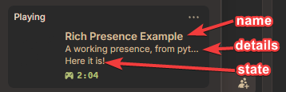

##################
Quickstart
##################

.. |br| raw:: html

    

+-------------------------------------------------------------------------------------------------------------------------+
|This page exists for if you have literally no clue what you're doing, or you just need a quick start. (For rich presence)|
+-------------------------------------------------------------------------------------------------------------------------+

**The first thing youll want to do is create a Discord RPC app. Here are the steps:**

- Navigate to `https://discord.com/developers/ <https://discord.com/developers/>`_
- Click "Create an Application."
- Setup the application how you want, give it the name you want, and give it a good image.
- Right under the name of your application, locate your Client ID. You will need this later.
- Lastly, save your application.

**Next, you need to install pypresence. You will need python 3.9+ installed. Here are the steps:**

- Open command prompt
- Type ``pip install pypresence`` and hit enter
- It should say something near the end that says something like ``"Successfully installed pypresence"``.

**Now you will need to create the program to set your rich presence. First we need to import what we need, like so:**

.. code-block:: python

 from pypresence import Presence # The simple rich presence client in pypresence
 import time

**Next we need to initialize our Rich Presence client. You'll need that Client ID from earlier:**

.. code-block:: python

 client_id = "ID HERE"  # Put your Client ID in here
 RPC = Presence(client_id)  # Initialize the Presence client

**Now we need to connect our Client to Discord, so it can send presence updates:**

.. code-block:: python

 RPC.connect() # Start the handshake loop

**Now we need to actually set our rich presence. We can use the update() function for this. There are many options we can use, but for this we will use these:**

.. code-block:: python

     RPC.update(
        state="Here it is!",
        details="A working presence, from python!",
        name="Rich Presence Example",
    ) # Updates our presence

**Now we need our program to run forever, so we use a while loop.**

.. code-block:: python

 while True:  # The presence will stay on as long as the program is running
     time.sleep(15) # Can only update rich presence every 15 seconds

**Now when you run your program, it should look something like this!**

|br|

**Using Activity Types and Status Display Types**

You can customize how your presence appears by using ``ActivityType`` and ``StatusDisplayType`` enums. Here's an example:

.. code-block:: python

 from pypresence import Presence
 from pypresence.types import ActivityType, StatusDisplayType
 import time

 client_id = "ID HERE"
 RPC = Presence(client_id)
 RPC.connect()

 # Show as "Listening to" instead of "Playing"
 RPC.update(
     activity_type=ActivityType.LISTENING,
     details="My Favorite Song",
     state="By My Favorite Artist"
 )

 # Or use StatusDisplayType to control what appears in the user's status
 RPC.update(
     status_display_type=StatusDisplayType.STATE,
     state="Building something awesome",
     details="Using pypresence"
 )

 while True:
     time.sleep(15)

Available activity types: ``PLAYING`` (default), ``LISTENING``, ``WATCHING``, ``COMPETING``

Available status display types: ``NAME`` (default - shows app name), ``STATE``, ``DETAILS``

|br|

**Making Your Presence Interactive with URLs**

You can make text and images clickable by using URL parameters. When users click on these elements, Discord will open the specified URL:

.. code-block:: python

 from pypresence import Presence
 import time

 client_id = "ID HERE"
 RPC = Presence(client_id)
 RPC.connect()

 # Make state and details clickable
 RPC.update(
     state="Playing an Awesome Game",
     state_url="https://example.com/game",
     details="In the Main Menu",
     details_url="https://example.com/game/menu"
 )

 # Make images clickable
 RPC.update(
     large_image="game_logo",
     large_text="My Game",
     large_url="https://example.com/game",
     small_image="status_online",
     small_text="Online",
     small_url="https://example.com/status"
 )

 while True:
     time.sleep(15)

Available URL parameters: ``state_url``, ``details_url``, ``large_url``, ``small_url``
